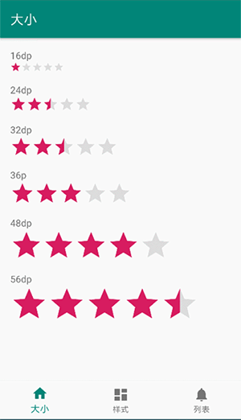
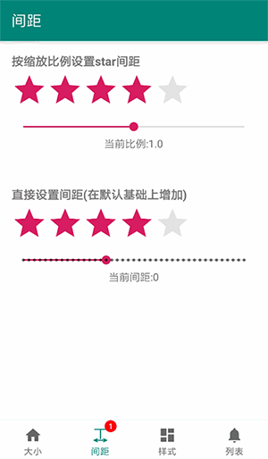
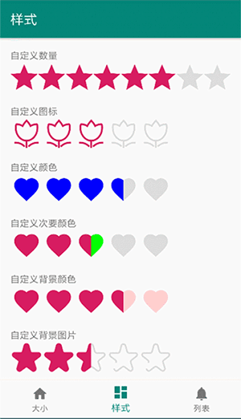
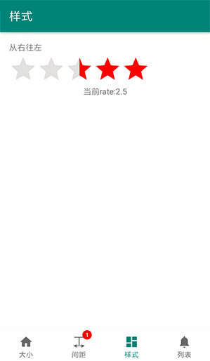
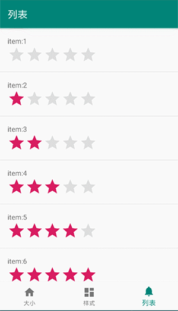

# AndRatingBar

[](https://android-arsenal.com/api?level=21) [](https://jitpack.io/#giswangsj/AndRatingBar)

A RatingBar library for android, you can customize size, spacing, color and image easily, and support right to left.\
安卓RatingBar终极方案，继承自原生RatingBar，具有原生的滑动选择等特性，并且可以自定义大小，间距，颜色，图标，支持从右当左

**Customize Size**



**Customize Spacing**



**Customize Color & Image**



**Right to Left Support**



**In RecyclerView**



Implementation
----


```xml
allprojects {
    repositories {
        maven { url 'https://jitpack.io' }
    }
}

dependencies {
	implementation 'com.github.giswangsj:AndRatingBar:1.0.4'
}
```

Usage
----

In your layout file:

```xml
<per.wsj.library.AndRatingBar
        android:layout_width="wrap_content"
        android:layout_height="48dp"
        app:starDrawable="@drawable/star_blue"
        app:bgDrawable="@drawable/star_gray"
        android:rating="2.5"/>
```

Event Listener
```xml
ratingBar.setOnRatingChangeListener { ratingBar, rating ->
   Log.e("ratingBar", "rating:$rating")
}
```


Configuration
----
AndRatingBar Inherit from Android RatingBar,so all the configuration of RatingBar can be \
configured to AndRatingBar,for example:

* `android:rating="1"` set the rating of RatingBar
* `android:numStars="8"` set the number of star
* `android:layout_height="36dp"` set the size of star
* `android:stepSize="0.5"` set the step size of RatingBar
* `android:isIndicator="true"` set if as indicator

AndRatingBar has it's own configuration as follows:

* `app:starDrawable=""` set the drawable of star 
* `app:bgDrawable=""` set the background drawable of star
* `app:starColor=""` set the color of star
* `app:subStarColor=""` set the subColor of star
* `app:bgColor=""` set the background color of star
* `app:keepOriginColor=""` set if keep the origin color of star drawable
* `app:starSpacing="4dp"` set the spacing of the star
* `app:scaleFactor="1.2"` the sacle factor of the ratingbar which can change the spacing of the star
* app:right2Left="true"  right to left support

## License

`AndRatingBar` is released under the Apache License version 2.0.