# 关于BottomNavigationView的姿势都在这里了


一，基本用法
----

1，首先需要添加依赖：

`implementation 'com.google.android.material:material:1.1.0'`

2，布局文件中引入：

```xml
<com.google.android.material.bottomnavigation.BottomNavigationView
    android:id="@+id/nav_view"
    android:layout_width="0dp"
    android:layout_height="wrap_content"
    android:layout_marginStart="0dp"
    android:layout_marginEnd="0dp"
    android:background="?android:attr/windowBackground"
    app:menu="@menu/bottom_nav_menu" />
```

3，常用属性：

- app:itemTextColor  文字的颜色，可以通过**selector**来控制选中和未选中的颜色

- app:itemIconTint     图标的颜色，可以通过**selector**来控制选中和未选中的颜色

- app:itemIconSize     图标大小，默认24dp

- app:iteamBackground   背景颜色，默认是主题的颜色

- app:itemRippleColor      点击后的水波纹颜色

- app:itemTextAppearanceActive     设置选中时文字样式

- app:itemTextAppearanceInactive  设置默认的文字样式

- app:itemHorizontalTranslationEnabled      在label visibility 模式为`selected`时item水平方向移动

- app:elevation                                                   控制控件顶部的阴影

- app:labelVisibilityMode                                 文字的显示模式

- app:menu                                                        指定菜单xml文件（文字和图片都写在这个里面）

  

4，menu文件：

```xml
<menu xmlns:android="http://schemas.android.com/apk/res/android">
    <item
        android:id="@+id/navigation_item1"
        android:icon="@drawable/ic_home_black_24dp"
        android:title="@string/title_size" />
    <item
        android:id="@+id/navigation_item2"
        android:icon="@drawable/ic_dashboard_black_24dp"
        android:title="@string/title_style" />
    <item
        android:id="@+id/navigation_item3"
        android:icon="@drawable/ic_notifications_black_24dp"
        android:title="@string/title_in_list" />
</menu>
```

​		在每个item中设置对应的icon和title即可。这里的icon可以是一个drawable，也可以是包含不同状态对应不同图片的**selector**。

​		设置了menu后一个基本的底部菜单栏就有了。

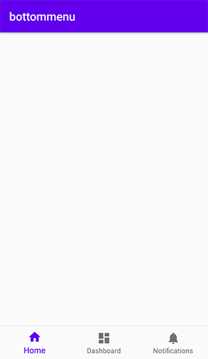

5，常用事件

​		主要用两个事件`OnNavigationItemSelectedListener`和`OnNavigationItemReselectedListener`

```kotlin
nav_view.setOnNavigationItemSelectedListener(
    BottomNavigationView.OnNavigationItemSelectedListener {
    when (it.itemId) {
        R.id.navigation_item1 -> {
            Log.e("bottomMenuView:", "home")
            return@OnNavigationItemSelectedListener true
        }
        R.id.navigation_item2 -> {
            Log.e("bottomMenuView:", "dashboard")
            return@OnNavigationItemSelectedListener true
        }
        R.id.navigation_item3 -> {
            Log.e("bottomMenuView:", "notification")
            return@OnNavigationItemSelectedListener true
        }
    }
    false
})
```

```kotlin
nav_view.setOnNavigationItemReselectedListener(
    BottomNavigationView.OnNavigationItemReselectedListener {
    Log.e("bottomMenuView:", it.itemId.toString())
})
```

​		两个事件的用法是一样的，区别在于：`OnNavigationItemSelectedListener`在item由未选中到选中状态时触发，而`OnNavigationItemReselectedListener`在item处于选中状态再次点击时触发。

6，最大Item数量

​		`BottomNavigationView`对显示的item数量做了显示，最多5个，超过就会抛出异常，源码如下：

```java
public final class BottomNavigationMenu extends MenuBuilder {
  	public static final int MAX_ITEM_COUNT = 5;
	// ...
  	@Override
  	protected MenuItem addInternal(int group, int id, int categoryOrder, CharSequence title) {
    if (size() + 1 > MAX_ITEM_COUNT) {
      throw new IllegalArgumentException(
          "Maximum number of items supported by BottomNavigationView is "
              + MAX_ITEM_COUNT
              + ". Limit can be checked with BottomNavigationView#getMaxItemCount()");
    }
    // ...
    return item;
  }
}
```

​		google这么做的原因大概是一般不会有超过5个的需求，而且超过5个以后就会显得很拥挤，UI效果比较差。


## 二，配合fragment

​		单纯使用`BottomNavigationView`并没有什么卵用，一般都是配合fragment来使用。配合fragment使用时有三种方式：

**1，FrameLayout + FragmentTransaction**

​		比较古老的一种方式通过`getSupportFragmentManager().beginTransaction()`获取到`FragmentTransaction `，然后通过`FragmentTransaction`的`add`，`show`，`hide`等方法来控制fragment的显示，这种方式比较繁琐就不赘述了。

**2，ViewPager**

​		`ViewPager`一种比较流行的方式，当然你也可以用`ViewPager2`，用法差不多。需要在布局文件中添加`ViewPager`。

​		**2.1，设置ViewPager的adapter，如下：**

```kotlin
mFragments.add(Fragment1.newInstance())
mFragments.add(Fragment2.newInstance())
mFragments.add(Fragment3.newInstance())
val adapter = object :
    FragmentStatePagerAdapter(
        supportFragmentManager,
        BEHAVIOR_RESUME_ONLY_CURRENT_FRAGMENT
    ) {
    override fun getItem(position: Int): Fragment {
        return mFragments[position]
    }

    override fun getCount(): Int {
        return mFragments.size
    }
}

viewPager.adapter = adapter
```

​		然后需要将`ViewPager`和`BottomNavigationView`绑定。

​		**2.2，ViewPager绑定BottomNavigationView**

​		就是在`ViewPager`切换时更改`BottomNavigationView`选中项

```kotlin
// 添加viewpager切换监听
viewPager.addOnPageChangeListener(object : ViewPager.OnPageChangeListener {
    // ...
    override fun onPageSelected(position: Int) {
        when (position) {
            0 -> {
                navigation.selectedItemId = R.id.navigation_item1
            }
            1 -> {
                navigation.selectedItemId = R.id.navigation_item2
            }
            2 -> {
                navigation.selectedItemId = R.id.navigation_item3
            }
        }
    }
})
```

​		**2.3，BottomNavigationView绑定ViewPager**

​		同样的，需要在`BottomNavigationView`选中项改变时更改ViewPager：

```kotlin
navigation.setOnNavigationItemSelectedListener(
    BottomNavigationView.OnNavigationItemSelectedListener { item ->
                when (item.itemId) {
                    R.id.navigation_item1 -> {
                        viewPager.currentItem = 0
                        return@OnNavigationItemSelectedListener true
                    }
                    R.id.navigation_item2 -> {
                        viewPager.currentItem = 1
                        return@OnNavigationItemSelectedListener true
                    }
                    R.id.navigation_item3 -> {
                        viewPager.currentItem = 2
                        return@OnNavigationItemSelectedListener true
                    }
                }
                false
            })
```

**3，配合navigation**

​		这种方式是Google官方目前主推的方式，需要你对`navigation`有所了解。

​		1，布局文件如下：

```xml
<androidx.constraintlayout.widget.ConstraintLayout xmlns:android="http://schemas.android.com/apk/res/android"
    xmlns:app="http://schemas.android.com/apk/res-auto"
    android:id="@+id/container"
    android:layout_width="match_parent"
    android:layout_height="match_parent">

    <com.google.android.material.bottomnavigation.BottomNavigationView
        android:id="@+id/nav_view"
        android:layout_width="0dp"
        android:layout_height="wrap_content"
        android:layout_marginStart="0dp"
        android:layout_marginEnd="0dp"
        android:background="?android:attr/windowBackground"
        app:layout_constraintBottom_toBottomOf="parent"
        app:layout_constraintLeft_toLeftOf="parent"
        app:layout_constraintRight_toRightOf="parent"
        app:menu="@menu/bottom_nav_menu" />

    <fragment
        android:id="@+id/nav_host_fragment"
        android:name="androidx.navigation.fragment.NavHostFragment"
        android:layout_width="match_parent"
        android:layout_height="match_parent"
        app:defaultNavHost="true"
        app:layout_constraintBottom_toTopOf="@id/nav_view"
        app:layout_constraintLeft_toLeftOf="parent"
        app:layout_constraintRight_toRightOf="parent"
        app:layout_constraintTop_toTopOf="parent"
        app:navGraph="@navigation/mobile_navigation" />

</androidx.constraintlayout.widget.ConstraintLayout>
```

​		2，navigation文件

```xml
<navigation xmlns:android="http://schemas.android.com/apk/res/android"
    xmlns:app="http://schemas.android.com/apk/res-auto"
    xmlns:tools="http://schemas.android.com/tools"
    android:id="@+id/mobile_navigation"
    app:startDestination="@+id/navigation_home">

    <fragment
        android:id="@+id/navigation_item1"
        android:name="per.wsj.bottommenu.ui.fragment.Fragment1"
        android:label="@string/title_home"
        tools:layout="@layout/fragment_home" />

    <fragment
        android:id="@+id/navigation_item2"
        android:name="per.wsj.bottommenu.ui.fragment.Fragment2"
        android:label="@string/title_dashboard"
        tools:layout="@layout/fragment_dashboard" />

    <fragment
        android:id="@+id/navigation_item2"
        android:name="per.wsj.bottommenu.ui.fragment.Fragment3"
        android:label="@string/title_notifications"
        tools:layout="@layout/fragment_notifications" />
</navigation>
```

​		在navigation中指定了对应的fragment

​		3，Activity中

​		接下来的使用就很简单了，调用Activity的扩展函数`findNavController`，根据布局文件中的`fragment`标签的id获取`NavController`，将`NavController`和`BottomNavigationView`绑定即可，如下：

```kotlin
val navView: BottomNavigationView = findViewById(R.id.nav_view)
val navController = findNavController(R.id.nav_host_fragment)
navView.setupWithNavController(navController)
```

​		效果如下：

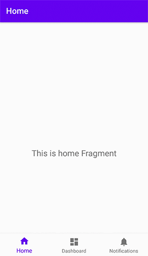


三，显示badge(角标/悬浮徽章)
----

​		还在`github`上查找怎么往`BottomNavigationView`上添加badge吗？`BottomNavigationView`默认提供了badge。

​		1，基本使用

​		在`BottomNavigationView`上添加badge很简单，它提供了如下操作badge的方法：

- getBadge(int menuItemId)                    获取badge

- getOrCreateBadge(int menuItemId)    获取或创建badge

- removeBadge(int menuItemId)            移除badge

  因此添加一个badge只需要如下代码：

```kotlin
val navView: BottomNavigationView = findViewById(R.id.nav_view)
val badge = navView.getOrCreateBadge(R.id.navigation_dashboard)
```

​		效果如下：


​		纳尼？怎么只有一个红点，胸弟别鸡动，还没设置数量

```kotlin
badge.number = 20
```
​		添加数量后效果如下：


​		2，常用属性

​		`getBadge`和`getOrCreateBadge`方法返回的都是`BadgeDrawable`，`BadgeDrawable`常用的属性/方法如下：

- backgroundColor             设置背景色

- badgeGravity                    设置Badge的显示位置，有四种可先：`TOP_START`，`TOP_END`，`BOTTOM_START`，`BOTTOM_END`，分别对应左上角，右上角，左下角和右下角。

- badgeTextColor                设置文字颜色

- maxCharacterCount         最多显示几位数字，比如该项设置了3，number设置为108，则显示`99+`，如下图所示：

  

  3，特殊需求

  细心的发现badge在顶部时是紧贴顶部的，如果想把它往下移一点怎么破？

  

​		4，注意事项

​		需要你Application的`Theme`继承自`Theme.MaterialComponents`，如下所示：

```xml
<style name="AppTheme" parent="Theme.MaterialComponents.Light.DarkActionBar">
    <item name="colorPrimary">@color/colorPrimary</item>
    <item name="colorPrimaryDark">@color/colorPrimaryDark</item>
    <item name="colorAccent">@color/colorAccent</item>
</style>
```

​		


## 四，常用需求

​		**1，动态显示/隐藏MenuItem**

​		有些时候需要根据条件来控制menuItem是否显示，有两种方式可以实现：

​		1.1， remove

```kotlin
val navView: BottomNavigationView = findViewById(R.id.nav_view)
navView.menu.removeItem(R.id.navigation_spacing)
```

​		这种方式是直接把这个item删除掉了，是一个不可逆的过程，也就是说删除后没法再显示出来

​		1.2， setVisible

```kotlin
// 显示
nav_view.menu.findItem(R.id.navigation_test).isVisible = true
// 隐藏
nav_view.menu.findItem(R.id.navigation_test).isVisible = false
```

​		效果如下：

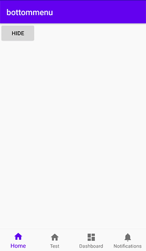

​		**2，更改字体颜色**

​		创建selector：

```xml
<?xml version="1.0" encoding="utf-8"?>
<selector xmlns:android="http://schemas.android.com/apk/res/android">
    <item android:color="#ff0000" android:state_checked="true"/>
    <item android:color="#00CC00" android:state_checked="false"/>
</selector>
```

​		设置`app:itemTextColor`属性：

```xml
<com.google.android.material.bottomnavigation.BottomNavigationView
    android:id="@+id/nav_view"
    android:layout_width="0dp"
    android:layout_height="wrap_content"
    android:background="?android:attr/windowBackground"
    app:itemTextColor="@drawable/selector_menu_text_color"
    app:menu="@menu/bottom_nav_menu" />
```

​		效果如下：

​		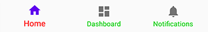

​		**3，修改字体大小**

​		字体大小分为选中的大小和未选中的大小，他们的默认值分别是14sp/12sp，可以通过覆盖原来的字体大小来改变字体大小。

```xml
<!--默认字体大小 -->
<dimen name="design_bottom_navigation_text_size">14sp</dimen>
<!--选中字体大小 -->
<dimen name="design_bottom_navigation_active_text_size">14sp</dimen>
```

​		修改前后的效果：

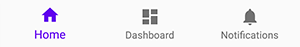

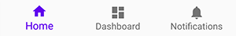

​		**4，自定义选中图标颜色**

​		图标的颜色是通过着色实现的，如果我们的图标不是纯色就需要特殊处理了。

​		比如如下图标：


​		可以通过`selector`来定义选中和未选中的状态，并设置给`menu item`的`icon`

```xml
<?xml version="1.0" encoding="utf-8"?>
<selector xmlns:android="http://schemas.android.com/apk/res/android">
    <item android:drawable="@drawable/ic_custom_icon" android:state_checked="true"/>
    <item android:drawable="@drawable/ic_custom_icon_default" android:state_checked="false"/>
</selector>
```

​		然后在`activity`中设置`itemIconTintList`为null

```kotlin
nav_view.itemIconTintList = null
```

​		效果如下：

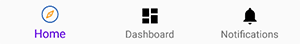

​		**5，labelVisibilityMode**

​		在前面基本属性中已经提到，文字的显示模式有四种:

- auto

  ​	这种模式就是item数量在三个及以下全部显示label，三个以上只显示选中item的label，效果如下：

  

- selected

  ​	该模式下，不管item数量是多少都只显示选中的item的label

  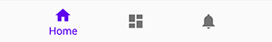

- labeled

  该模式下，不管item数量是多少item的label都显示

  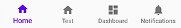

- unlabeled

  该模式下，item的label始终不显示

  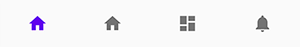

  label的显示模式可以在布局文件中通过`labelVisibilityMode`设置，也可以在java代码中通过`setLabelVisibilityMode`设置

​		**6，切换时的动画效果？**

​		很多人说切换时会有动画效果，如下：

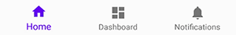

​		其实这并不是什么动画效果，只是因为选中时文字的字体变大了(实际上是两个字体大小不一样的`TextView`切换显示状态)，把图标撑起来了，再加上点击时的`Ripple`效果，感觉就是一个高大上的动效。要去掉这个效果只需要将字体选中和默认的大小改成一致即可，效果如下：

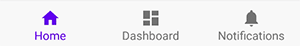

​		**7，图标文字间距**

​		7.1 调整图标到顶部的距离

​		如果想调整图标和文字间的距离，改怎么办呢？查了一些资料大部分都是通过添加`dimen`覆盖默认的`design_bottom_navigation_margin`来实现。

```xml
<dimen name="design_bottom_navigation_margin">4dp</dimen>
```

​		该值默认是把8dp，把它调小了，发现图标和文字的距离变大了，这是怎么回事？其实这个距离并不是图标和文字的间距，而是图标距离顶部和底部的`Margin`值，调小后到顶部的距离也变小了，就显得图标和文字的距离变大了。

​		如果你有显示badge的需求，那这种方式就出问题了，因为badge是依附于图标的，图标上移，badge也会跟着上移，可以就显示不全了


​		7.2 调整文字到底部的距离

​		那么如果我想调整文字到底部的距离呢？这就需要了解一下每个Item的布局文件`design_bottom_navigation_item.xml`，其源代码（部分代码省略）如下：

```xml
<merge xmlns:android="http://schemas.android.com/apk/res/android">
  <ImageView
      android:id="@+id/icon"
      android:layout_width="24dp"
      android:layout_height="24dp"
      android:layout_marginTop="@dimen/design_bottom_navigation_margin"
      android:layout_marginBottom="@dimen/design_bottom_navigation_margin"
      android:layout_gravity="center_horizontal"/>
  <com.google.android.material.internal.BaselineLayout
      android:layout_width="wrap_content"
      android:layout_height="wrap_content"
      android:layout_gravity="bottom|center_horizontal"
      android:paddingBottom="10dp">
    <TextView
        android:id="@+id/smallLabel"
        android:layout_width="wrap_content"
        android:layout_height="wrap_content"
        android:textSize="@dimen/design_bottom_navigation_text_size"/>
    <TextView
        android:id="@+id/largeLabel"
        android:layout_width="wrap_content"
        android:layout_height="wrap_content"
        android:textSize="@dimen/design_bottom_navigation_active_text_size"
        android:visibility="invisible"/>
  </com.google.android.material.internal.BaselineLayout>
</merge>
```

​		可见如果想修改文字到底部的距离可以改动其父容器`BaselineLayout`的`bottomMargin`属性，或调用父容器的`scrollBy()`使内部的`TextView`向下偏移，当然此时就需要用到反射。

```java
public static void hookBnv(BottomNavigationView menu) throws Exception{
    Class<BottomNavigationView> bottomNavigationViewClass = BottomNavigationView.class;
    Field menuViewField = bottomNavigationViewClass.getDeclaredField("menuView");
    menuViewField.setAccessible(true);
    Object menuView = menuViewField.get(menu);

    Class<BottomNavigationMenuView> bottomNavigationMenuViewClass = BottomNavigationMenuView.class;
    Field buttonsField = bottomNavigationMenuViewClass.getDeclaredField("buttons");
    buttonsField.setAccessible(true);
    Object[] buttons = (Object[]) buttonsField.get(menuView);
    
    for (Object button : buttons) {
        Class<BottomNavigationItemView> bottomNavigationItemViewClass = BottomNavigationItemView.class;
        Field smallLabelField = bottomNavigationItemViewClass.getDeclaredField("smallLabel");
        smallLabelField.setAccessible(true);
        TextView smallLabel = (TextView) smallLabelField.get(button);

        // 方式一:
//      ViewGroup.MarginLayoutParams layoutParams = (ViewGroup.MarginLayoutParams) ((ViewGroup) smallLabel.getParent()).getLayoutParams();
//      layoutParams.bottomMargin = -15;
//      ((ViewGroup) smallLabel.getParent()).setLayoutParams(layoutParams);
        // 方式二:
        ((ViewGroup) smallLabel.getParent()).scrollBy(0,-15);
    }
}
```

​		效果如下：

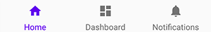


​		**8，修改控件高度**

​		`BottomNavigationView`的默认高度是56dp，如果遇到操蛋的需求非要改它的话就覆盖一下`design_bottom_navigation_height`吧，如下：

```
<dimen name="design_bottom_navigation_height">84dp</dimen>
```

## 四，结语

​		关于`BottomNavigationView`可能用到的知识点就这些了，如果你还有还有什么奇葩的需求，那就去**“look the fuck resource code”** 吧


https://mp.weixin.qq.com/s/k6GUzoE5b-MiekmrO9_VTg?

http://www.imooc.com/article/281803